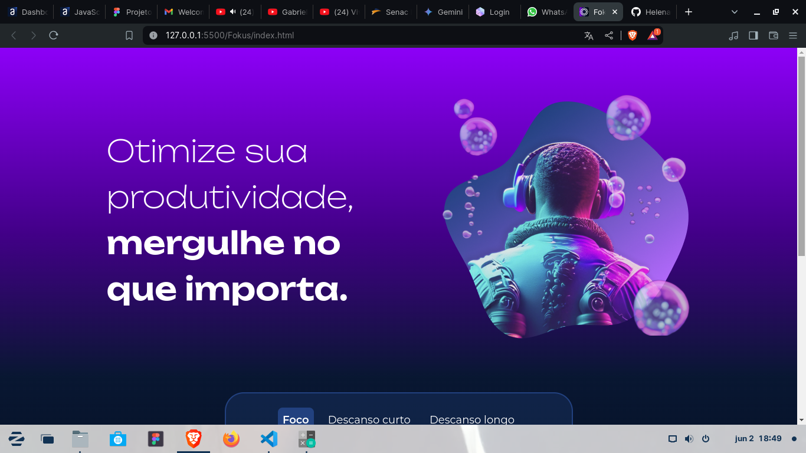
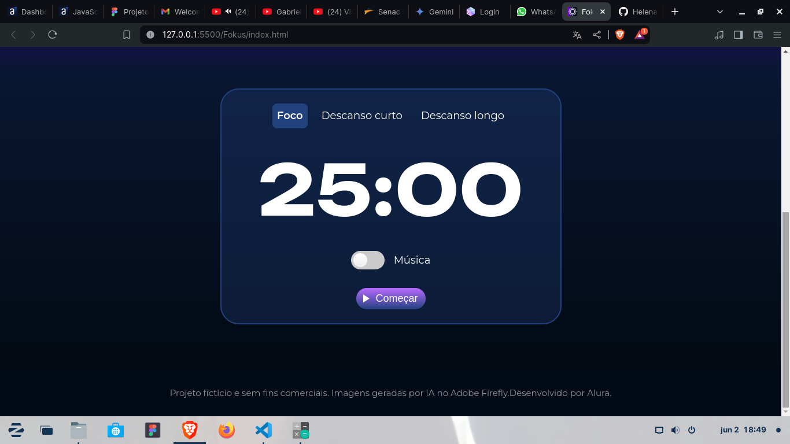

# Fokus-Alura
> Acesse aqui: https://helenaoliveira366.github.io/Fokus-Alura/

Manipulando o DOM (Document Object Model) para construir um pomodoro funcional com interface interativa e amigável.
 
Suas funcionalidades são várias:
- Atualizar o tempo na tela (com Date JS)
- Modificar a aparência da interface de acordo com o tempo (contexto) do pomodoro (com DOM)
- Emissão de sons (com Web Audio JS) para indicar o início e o fim de cada ciclo.

## O que foi abordado nesse projeto?
- Manipulaçao do DOM
- Funções
- Eventos JS
- Audio object
- Date Object
- setInterval() e clearInterval()
- Adição e remoção de classe

